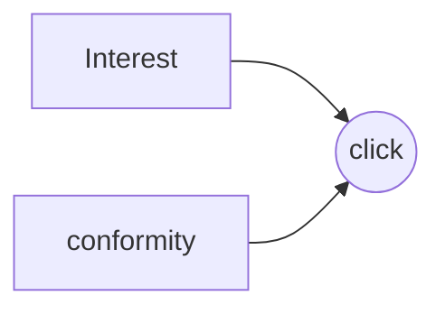



# 笔记：因果推断在快手推荐场景的应用探索

## 背景
##### 因果推断的三个层次
关联-->干扰-->反事实推断
##### 推荐系统的偏差
来源：训练推荐模型大多为观测数据

本质：对于经验风险函数估计的期望和真实理想的风险函数期望之间的差异

     机器学习了带bias的数据集，会放大bias（bias amplification）
##### 推荐系统的常见偏差
   1.选择性偏差（selection bias）：在建模过程中因样本选择的非随机性而导致得到的结论存在偏差

2.流行度偏差（popularity bias）：用户对物品的评价会收到群体意见的影响

3.曝光偏差（exposure bias）：用户只与推荐系统展示的物品产生交互

4.位置偏差（location bias）：用户和物品的交互情况可能被物品在推荐列表中的位置所影响
## 最新研究进展

    解读：1.流行度和兴趣是分别独立的
    	 2.在特定的点击下他们具有一定的关联关系，如点击流行度低的商品更能反应用户的兴趣
    	 3.问题演化成如何去建模interest和conformity的表征 
    	 	-->如何构建数据集<u, pos_item, neg_item>
    	 		-->user点击的pos_item的流行度明显小于neg_item，我们就认为这一次点击是基于兴趣的
    	 		-->如果点击视频的流行度大，这次点击就可能基于从众心理等
    	 
    	 
实验方法：
1.数据集切分：构建pairwise样本，并根据positive item与negative item的流行度强弱划分数据
2.Multi-task learning:

##### DICE Method

$L_{interest}^{O_2} = \sum_{(u,i,j)\in O_2}BPR((u_{int},i_{int}),(u_{int},i_{int})$$
$L_{comformity}^{O_1} = \sum_{(u,i,j)\in O_1}BPR((u_{con},j_{con}),(u_{ con},j_{con})$
$L =L_{click}^{O_1 + O_2} +\alpha(L_{interest}^{O_2}+L_{confotmity}^{O_1+O_2}) + \beta L_{discrepancy}$

   >$\beta L_{discrepancy}$是为了让interest embedding和conformity  embedding有一定的适配性。
  
##### DIB Method 

>$L_{DIB}$ :=min$(\beta I(z;x) - I(z;y) +rI(z;r)- \alpha I(r;y))$
>$\beta I(z;x)$：由于输入变x有偏，无偏表征z不能过度拟合输入变量
>$I(z;y)$：无偏表征z要尽可能准确地预测目标y
>$rI(z;r)$：无偏表征z要尽可能与有偏表征r区分开，即z与y相互独立
>$\alpha I(r;y)$有偏表征r对于y有间接影响，则r在一定程度上能够影响y
>$I(varible 1, varible 2)$:通过相关性，相关性越大，该值越接近1，否则接近0

>$\hat{L}_{DIB} = (1-r)H(y|z) -(r-a)H(y|r) +rH(y|z,r)+\beta||\mu(x)||_2^2$
>$(1-r)H(y|z)$:无偏表征z的预测值与y的交叉熵
>$(r-a)H(y|r)$：有偏表征r的预测值与y的交叉熵
>$rH(y|z,r)$：整体表征z的预测值与y的交叉熵
>$\beta||\mu(x)||_2^2$：正则项

##### MACR Motivation

建模

$L_O = \sum_{(u,i)\in D} - y_{ui}log(\sigma(\hat{y}_{ui}))-(1-y_{ui}log(1-\sigma(\hat{y}_{ui}))$
$L_O = \sum_{(u,i)\in D} - y_{ui}log(\sigma(\hat{y}_{ui}))-(1-y_{ui}log(1-\sigma(\hat{y}_{ui}))$
$L_O = \sum_{(u,i)\in D} - y_{ui}log(\sigma(\hat{y}_{ui}))-(1-y_{ui}log(1-\sigma(\hat{y}_{ui}))$
Train: $\hat{y}_{ui} = \hat{y}_{k}*\sigma(\hat{y}_{i})*\sigma(\hat{y}_{u})$
Infer:$\hat{y}_{k}*\sigma(\hat{y}_{i})*\sigma(\hat{y}_{u}) - c*\sigma(\hat{y}_{i})*\sigma(\hat{y}_{u})$

## 因果推断在快手的应用
问题：头部效应严重，热门内容曝光过大，部分高曝光视频的pxtr远低于高曝光视频评价pxtr（推广效率）
       	
    常用解决方案：   
    1.Inverse Propensity Weighting(IPW): 给样本加popularity unbiased 权重
    	-->流行度值变化非常大，数据方差大
    2.Causal Embedding：用无偏的统一数据来指导模型无偏embedding，模型对item流行度不敏感
        -->需要人为划分两份数据集，带有人的bias；或者用无偏数据集，但无偏数据集很贵
    3.直接建模：popularity对模型的影响
    	-->没有理论支撑，加入bias不好控制对模型的影响，容易被其他特征淹没
   
##### 方法：流行度debias
>核心问题：
>1.流行度偏差确实不利于学习用户真实兴趣
>2.曝光高的视频内容质量相对较高
>3.用户有看热门的需求
>解决方法：
>Train：去除流行度偏差对魔性的负向影响
>Infer：利用流行度的有益部分
>

训练阶段
>通过因果干预的方法（do-calculus）去掉流行度对模型的影响
$P(C|do(U,I)) = P_{G^{'}}(C|U,I)$
					$=\sum_{z}P_{G^{'}}(C|U,I,z)P_{G^{'}}(z|U,I)$ -->贝叶斯推导
					$= \sum_{z}P_{G^{'}}(C|U,I,z)P_{G^{'}}(z)$ -->消除边之后之后，U，I，z独立
					$= \sum_{z}P(C|U,I,z)P(z)$ -->流行度先验在z- I边消除前后一致
					$=\sum_{z} ELU'(f_\theta(u,i)*z^rP(z)$-->带入解耦结果
					$=ELU'(f_\theta(u,i)*\sum_{z}z^rP(z)$
					$=ELU'(f_\theta(u,i)*E(z^r)$ -->流行度变成了期望的表现形式，常数对序列不影响，相当于消除了

建模
>建模       $\sum_{z}P(C|U,I,z)$
>解耦用户、视频与视频流行度：
>$$P_\theta(c=1|u,i,m_i^t) = ELU'(f_\theta(u,i)*(m_i^t)^r$$
>$$ ELU'(x)=\left\{
\begin{aligned}
  e^x,  x <=0 \\
x+1,  else
\end{aligned}
\right.
$$
>Loss function:
>$$max_{\theta}\sum_{(u,i,j)\in D}log(P_\theta(c=1|u,i,m_i^t) - P_\theta(c=1|u,j,m_j^t))$$
      
改进落地

				
	1.使用pointwise交叉熵代替pairwise损失函数
	2.激活函数使用RELU代替 ELU‘
	3.使用曝光占比之间的梯度代替绝对值差值表征流行度的变化趋势
	4.把控infer阶段注入流行有益部分的内容质量
	
 结果
 		
 	-----分布变化-----
 	训练阶段对流行度消偏：
 	1.中低曝光区间item个数增加
 	2.中低曝光区间的曝光占比增加
 	Infer阶段注入期望流行度：
 	1.高曝光区间的曝光量提升比例较大
 	-----效率变化-----
 	训练阶段对流行度消偏：
 	低曝光区间emp_pxtr提升更大
 	
##### 因果表征解耦
数据集构建

	conformity相关的正负样本：由like数定义
	feedback相关的正负样本：由用户观看时长和互动的综合打分定义
	interest相关的正负样本：正样本是用户feedback但是conformity低的样本

##### 完播率debias
背景

	系统对正样本的定义基于一定的规则：
	-->不能很好你和不同时长下的正样本判断
	-->对于长视频而言这种判断方式偏差较大
	完播率（pcr）一般用于衡量用户对于视频的偏好
	短时长视频的pcr普遍高于长时长视频pcr，因此单独使用pcr来衡量用户对视频的偏好会导致推荐系统倾向于推荐短时长视频
>正负样本定义：
>1.对各长度视屏定义均适用
>2.具有一定判别性
>3.具有一定物理意义

判别方式

	单条样本完播率 VS 统计各长度视频完播率

不同长度视频播放完成度消偏

>因果推断- inverser propensity weighting（IPV）
	1.偏差本质：不同长度的视频正负样本分布不均
	2.使用全部数据计算因果效应
	3.去除变量在treatment和control组中的分布差异
	*propensity定义：e(x) = Pr(T=1|X=x)
	*IPW权重定义： $w_i =\frac{t_i}{e(x)}+\frac{1-t_i}{1-e(x)}$
	*Loss Function: $L_i = \frac{1}{Positive Ratio}ylog(p_x) + \frac{1}{NegativeRatio}(1-y)log(1-p_i)$ 
	
